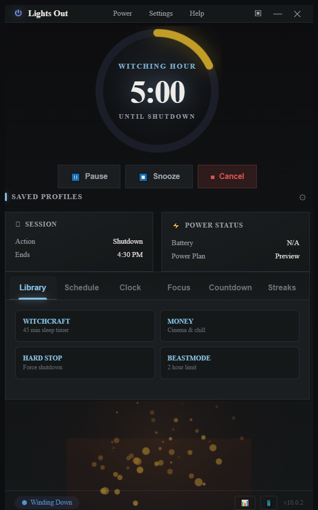

# Lights Out

**A clean Windows wind-down and shutdown timer for people who do not want to touch Command Prompt, PowerShell, or Task Scheduler.**

Set a bedtime. Lights Out handles the rest: a calm wind-down, ambient visuals,
optional smart-light sunrise, and a deliberate shutdown action when the timer
ends. No surprise countdowns. No hidden force-quits.


### I built this because I use it every night

I got tired of shutting down my PC the hard way. Command-line timers are fine
until you typo `shutdown /s /t 3600` and your screen goes black. Task Scheduler
works but feels like doing taxes at bedtime. I wanted something that felt like
closing a book, not launching a missile.

Lights Out opens idle. You pick a time, press START, and the app walks you
through a wind-down. If you change your mind, you cancel. No drama.

### Free because trust comes first

- **No account.** Nothing to sign up for.
- **No subscription.** The whole app is free.
- **No ads. No telemetry.** Your data stays on your machine.

Lights Out makes one outbound connection by default: a periodic check against the
GitHub Releases API for a newer version. It sends no personal data and no usage
analytics. Smart-light, calendar, and Wi-Fi features only reach out when you set
them up.

### Proof-backed releases

Every release ships an installer, a portable build, and SHA256 checksums, built
and published by CI. No hand-edited binaries. No mystery downloads.

- Latest release: https://github.com/Z3r0DayZion-install/lights-out/releases/latest
- Installer: `Lights Out Setup *.exe`
- Portable: `LightsOut.exe`
- Checksums: `SHA256SUMS.txt`


## Surfaces

There are two surfaces in this repo:

- **`electron/`** - the primary shipping UI, a cockpit-style dashboard (Electron).
- **`source/SleepTimer-Tonight.ps1`** - the original PowerShell / WinForms app,
  kept as a fallback and for Windows system integration. Compiles to `SleepTimer.exe`.

New feature work targets the Electron edition. See [`AGENTS.md`](AGENTS.md) for the
full contributor handoff and which runtime owns a given task.

## Features

- Countdown to shutdown, restart, sleep, hibernate, or log out.
- Start, pause, resume, snooze, cancel, mini mode, tray, and taskbar progress.
- **Nightly tray utility** - sit in the tray and show the current time while idle
  (Clock Mode), start common timers (28 min / 1 hour) and pause / resume / snooze /
  cancel straight from the tray, with the live countdown kept in the tray tooltip.
- **Customizable clock faces** - choose a digital, analog, or hybrid idle clock,
  with Modern / Bold / Minimal / Neon styles, a custom hand color, and an optional
  second hand. Right-click the clock to cycle faces.
- **Wind-down phase** - ambient visuals (fireplace, rain, starfield, aurora),
  warm color shift, and optional Night Light / media pause.
- **Stateful settings** - everything persists to `userData\settings.json` and is
  restored on launch.
- **Customization console** - accent color, theme (Midnight / Carbon / Aurora),
  ring style, window opacity, and sound volume, applied live.
- **Smart Lights** - Philips Hue or HTTP webhook (gradual dim, warm shift, off-at-end).
- **Saved profiles** - save the current timer as a profile in one click, schedule
  by duration or a specific date/time, and right-click a profile to Start, Edit, or
  Delete it. Plus **calendar scheduling** (.ics import).
- **Last Light finale** - an optional cinematic timer-zero sequence.
- **Imminent-action warning** - a grace-period dialog with Snooze / Cancel.
- **Crash recovery** - an interrupted countdown offers Resume / Dismiss on restart.



## Why it is safe by default

- Opens idle, never as an instant countdown.
- Force shutdown is an explicit, clearly named action, never the default. It is
  opt-in (Settings) or via the explicitly named
  `Lights Out - Force Shutdown Within 1 Hour.bat`.
- "Run at login" means start minimized and idle, nothing more.
- **System actions are opt-in.** Night Light, media pause, and window lockout
  during wind-down are all OFF by default. The app never touches your OS unless
  you explicitly enable it.


## Run the Electron app

```powershell
cd electron
npm install   # first time only
npm start
```

## Build a Windows package

```powershell
cd electron
npm run build   # portable LightsOut.exe + installer in ../dist
```

## Develop & verify

```powershell
cd electron
npm run icons   # regenerate app icon/logo from assets/*.svg
npm run smoke   # syntax, settings/last-light/smart-light round-trips, UI checks
```

CI (`.github/workflows/ci.yml`) runs lint + smoke on Linux and packages on Windows
for every push.

## License

[MIT](LICENSE)
