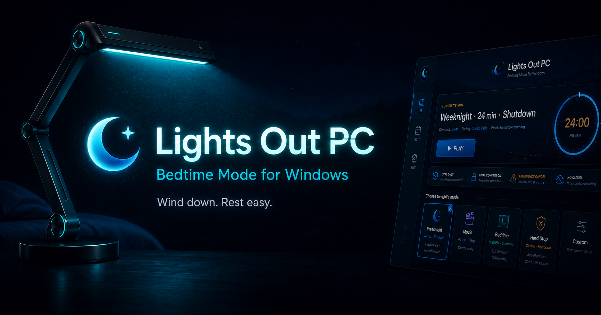

# Lights Out PC

**Bedtime Mode for Windows.**

Set a time. Press START. Lights Out walks you through a calm wind-down, then a
cinematic Last Light final countdown before your PC shuts off. Emergency cancel
is always available. No surprise force-quits. No cloud account. No drama.

[](https://github.com/lazelife420-spec/Lights-out/releases/tag/v10.3.0)

## Download

**[→ Lights Out v10.3.0 — installer, portable EXE, SHA256 checksums](https://github.com/lazelife420-spec/Lights-out/releases/tag/v10.3.0)**

- `Lights.Out.Setup.10.3.0.exe` — NSIS installer, standard Windows install
- `LightsOut.exe` — portable, runs from any folder, no install needed
- `SHA256SUMS.txt` — checksums for both artifacts



### Why I built it

I got tired of shutting down my PC the hard way. `shutdown /s /t 3600` works
until you typo it and your screen goes black mid-project. Task Scheduler is fine
but feels like doing taxes at bedtime. I wanted something that felt like closing
a book, not launching a missile.

Lights Out opens idle. No auto-start countdown. You pick a time, press START,
and the app walks you through a wind-down. The Last Light cinematic final
countdown runs, then the machine shuts down. Emergency cancel is always one
keystroke away (`Ctrl+Shift+S`).

### Free. Local. No account.

- **No account.** Nothing to sign up for.
- **No subscription.** The whole app is free.
- **No ads. No telemetry.** Your data stays on your machine.
- **No cloud.** Receipts and settings live in `AppData`, never a server.

One outbound connection by default: a periodic check against the GitHub Releases
API for a newer version. No personal data. No usage analytics. Smart-light,
calendar, and Wi-Fi features only reach out when you configure them.

### Proof-backed releases

Every release ships an installer, a portable build, and SHA256 checksums, built
and published by CI. No hand-edited binaries. No mystery downloads.

- Latest release: https://github.com/lazelife420-spec/Lights-out/releases/latest
- v10.3.0 release: https://github.com/lazelife420-spec/Lights-out/releases/tag/v10.3.0
- Smoke suite: 131/131 passing

## Surfaces

There are two surfaces in this repo:

- **`electron/`** - the primary shipping UI, a cockpit-style dashboard (Electron).
- **`source/SleepTimer-Tonight.ps1`** - the original PowerShell / WinForms app,
  kept as a fallback and for Windows system integration. Compiles to `SleepTimer.exe`.

New feature work targets the Electron edition. See [`AGENTS.md`](AGENTS.md) for the
full contributor handoff and which runtime owns a given task.

## Features

- Countdown to shutdown, restart, sleep, hibernate, or log out.
- Start, pause, resume, snooze, cancel, mini mode, tray, and taskbar progress.
- **Nightly tray utility** - sit in the tray and show the current time while idle
  (Clock Mode), start common timers (28 min / 1 hour) and pause / resume / snooze /
  cancel straight from the tray, with the live countdown kept in the tray tooltip.
- **Customizable clock faces** - choose a digital, analog, or hybrid idle clock,
  with Modern / Bold / Minimal / Neon styles, a custom hand color, and an optional
  second hand. Right-click the clock to cycle faces.
- **Wind-down phase** - ambient visuals (fireplace, rain, starfield, aurora),
  warm color shift, and optional Night Light / media pause.
- **Stateful settings** - everything persists to `userData\settings.json` and is
  restored on launch.
- **Customization console** - accent color, theme (Midnight / Carbon / Aurora),
  ring style, window opacity, and sound volume, applied live.
- **Smart Lights** - Philips Hue or HTTP webhook (gradual dim, warm shift, off-at-end).
- **Saved profiles** - save the current timer as a profile in one click, schedule
  by duration or a specific date/time, and right-click a profile to Start, Edit, or
  Delete it. Plus **calendar scheduling** (.ics import).
- **Phone Companion Easy Connect** - control Lights Out from your phone on the same
  Wi-Fi via a simple QR scan + pairing code. Off by default, token-protected, and never
  exposes LAN access in "This PC only" mode.
- **Last Light finale** - a cinematic timer-zero sequence with countdown ring,
  atmospheric panels, and UNPLUG visual (v10.1.0 northstar design). Power action
  fires automatically; emergency cancel (`Ctrl+Shift+S`) is always available.
- **Morning Proof hero** - after a completed session, a full-width card shows
  real stats: session length, action, snooze count, total runs. No fake data.
- **Imminent-action warning** - a grace-period dialog with Snooze / Cancel.
- **Crash recovery** - an interrupted countdown offers Resume / Dismiss on restart.


## Why it is safe by default

- Opens idle, never as an instant countdown.
- Force shutdown is an explicit, clearly named action, never the default. It is
  opt-in (Settings) or via the explicitly named
  `Lights Out - Force Shutdown Within 1 Hour.bat`.
- "Run at login" means start minimized and idle, nothing more.
- **System actions are opt-in.** Night Light, media pause, and window lockout
  during wind-down are all OFF by default. The app never touches your OS unless
  you explicitly enable it.


## Run the Electron app

```powershell
cd electron
npm install   # first time only
npm start
```

## Build a Windows package

```powershell
cd electron
npm run build   # portable LightsOut.exe + installer in ../dist
```

## Develop & verify

```powershell
cd electron
npm run icons   # regenerate app icon/logo from assets/*.svg
npm run smoke   # syntax, settings round-trips, startup/tray guards, UI wiring, preview-safe defaults
```

CI (`.github/workflows/ci.yml`) runs lint + smoke on Linux and packages on Windows
for every push.

## License

[MIT](LICENSE)
