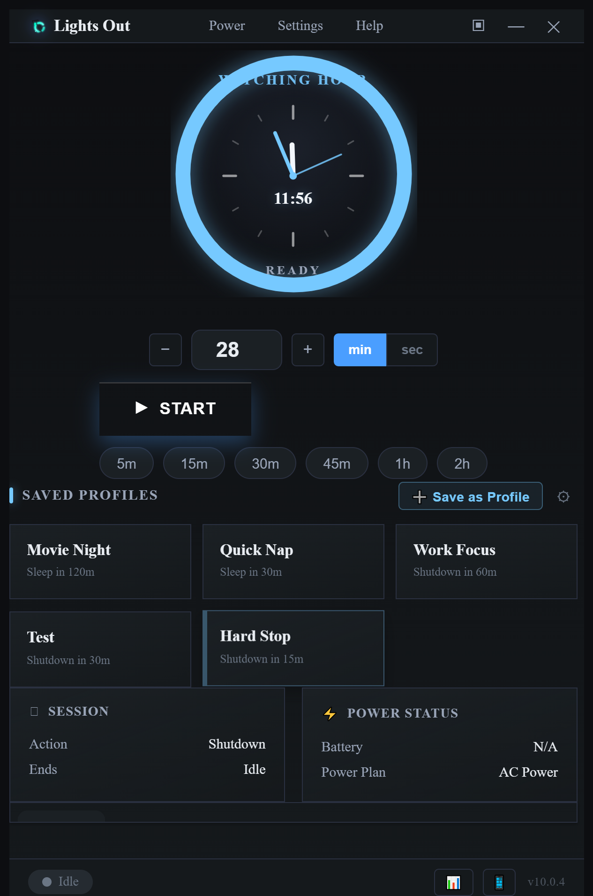

# Lights Out

I built a Windows shutdown timer I would actually use every night.

Windows commands work, but they are annoying.
Old shutdown timer apps work, but most feel clunky.

Lights Out is free:
No account.
No subscription.
No ads.

Installer, portable build, SHA256 checksums, and proof-backed releases are all public.

**Download:** https://github.com/Z3r0DayZion-install/lights-out/releases/latest

## What it does

- **Nightly tray utility.** It sits in your tray and shows the current time while
  idle (Clock Mode) - pick a digital, analog, or hybrid clock face and recolor the
  hands. Start common timers (28 min / 1 hour), or pause / resume / snooze / cancel
  straight from the tray. The live countdown stays in the tray tooltip.
- **Countdown to shutdown, restart, sleep, hibernate, or log out.**
- **Wind-down phase** with ambient visuals (fireplace, rain, starfield, aurora),
  a warm color shift, and optional Night Light / media pause.
- **Smart lights, saved profiles, calendar scheduling (.ics), and a Last Light
  finale** for the people who want the full ritual.

## Safe by default

- Opens idle, never as an instant countdown.
- Force shutdown is an explicit, clearly named action - never the default, never
  hidden in the tray.
- "Run at login" means start minimized and idle, nothing more.
- System actions (Night Light, media pause, window lockout during wind-down) are
  all OFF by default. The app never touches your OS unless you turn them on.

## Proof-backed releases

Every release ships an installer, a portable EXE, and a `SHA256SUMS.txt` so you can
verify exactly what you downloaded. Builds are produced and published by CI, and
each release is gated on `node --check`, a smoke suite, and a successful package
step.

**Latest: v10.1.0** - adds the northstar visual UI: cinematic Last Light overlay, Lobby shell with sidebar, and Morning Proof hero with real session stats. Settings persistence for new UI state. Smoke suite expanded to 57 assertions.
Release notes: https://github.com/Z3r0DayZion-install/lights-out/releases/tag/v10.1.0

Previously, v10.0.9 restored the Streaks tab panel and fixed a cancel-timer error where guided breathing cleanup could show a red error toast.

Previously, v10.0.7 fixed clock preference restoration on app launch and
prevented saved clock settings from being overwritten by startup defaults;
v10.0.6 added a smooth sweeping second hand, a new Classic (Roman)
watch face, Hybrid as the default clock, and a fix for a startup crash when a
companion port was already in use; v10.0.5 brought a crisp small-size app icon
and an About dialog with the brand wordmark; v10.0.4 added customizable clock
faces (digital / analog / hybrid), the desk-lamp logo, and right-click menus on
profiles and the clock.

---

### Short version (for social / forum posts)

> Lights Out - a free Windows bedtime shutdown timer that lives in your tray.
> Shows the clock while idle, starts a 28-min or 1-hour timer in one click, winds
> down with ambient visuals, and never force-shuts-down unless you ask it to.
> No account, no ads. Installer + portable + SHA256 checksums, all public.
> https://github.com/Z3r0DayZion-install/lights-out/releases/latest
